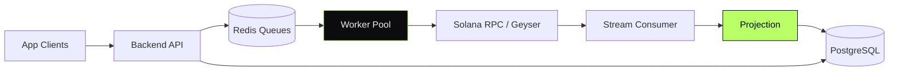

<div align="center">

```
   ██████╗ ██╗   ██╗███╗   ███╗██████╗
   ██╔══██╗██║   ██║████╗ ████║██╔══██╗
   ██████╔╝██║   ██║██╔████╔██║██████╔╝
   ██╔═══╝ ██║   ██║██║╚██╔╝██║██╔═══╝
   ██║     ╚██████╔╝██║ ╚═╝ ██║██║
   ╚═╝      ╚═════╝ ╚═╝     ╚═╝╚═╝
```

# Solana Pump.fun High-Throughput Backend

#### Backend infrastructure interfacing with Solana Pump.fun at scale.

[](#)
[](#)
[](#)
[](#)

</div>

---

> **TL;DR** — A backend designed to keep up with Solana's throughput while
> driving real product behavior on top.

---

## Overview

A backend interfacing with Solana Pump.fun mechanics: streaming on-chain
events, projecting state, exposing it to downstream apps, and issuing
on-chain actions through a managed worker pool. Built to survive the
throughput Solana actually produces.

> This repository documents the system at the **architectural level**.
> Implementation code is private.

---

## My Role

> **Backend Engineer.** Streaming, projection, worker pool design.

- Service architecture (NestJS)
- Streaming projection from Solana RPC / Geyser
- Worker pool for outbound on-chain actions
- Redis-backed queues and back-pressure
- Multi-RPC strategy

---

## Architecture



---

## Capabilities

- **Streaming projection** — on-chain events into relational state
- **Worker pool** — outbound on-chain actions with rate budget
- **Back-pressure queues** — survives peak bursts
- **Multi-RPC** — provider rotation with health scoring

---

## Architectural Decisions & Tradeoffs

### 1. Project, don't query

For high-throughput chains, pulling on every request collapses under load.
A continuously-updated projection answers reads cheaply.

### 2. Worker pool with budget, not unlimited fanout

Outbound on-chain calls run through a worker pool with a rate budget. The
chain doesn't drown, neither does the wallet.

### 3. Multi-RPC by default

Single RPC is single point of failure. Provider rotation with health
scoring is the default, not the exception.

---

## Engineering Invariants

- **Never** rely on a single RPC
- **Never** mutate state from a stream consumer — only projections write reads
- **Never** queue without a kill-switch

---

## Related Public Documents

- [`sundog`](https://github.com/eldardzh/sundog) — Solana product on top of similar patterns
- [`market-making-infra`](https://github.com/eldardzh/market-making-infra) — companion execution layer

---

<div align="center">

#### **Contact**
[**eldardzh.com**](https://eldardzh.com) · [**@EldarDissmay**](https://x.com/EldarDissmay) · **dissmay21@gmail.com**

<sub>© 2026 · Eldar D.</sub>

</div>
